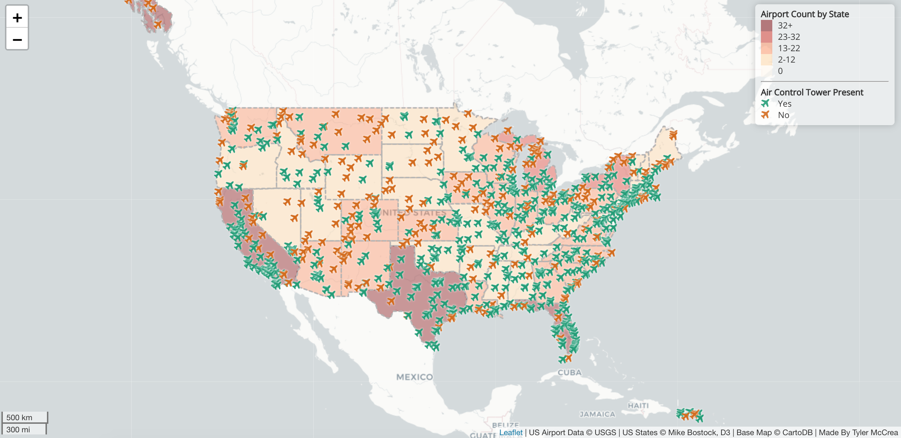

# US Airports Web Map (example)

Example for deliverable of GEOG 458 Lab 3 Assignment

Contains:
```powershell
[tpmccrea/AirportWebMap]
    │index.html
    │readme.md
    ├─assets
    │      airports.geojson
    │      us-states.geojson
    ├─css
    │      main.css
    ├─img
    │      AirportWebMap.png
    └─js
            main.js
```

This repository contains the necessary files to display an interactive web map of airports in the US, to display the count by state as a chororpleth map, and to display whether or not an airport has an air traffic control tower present. 


